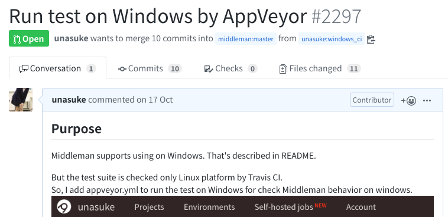
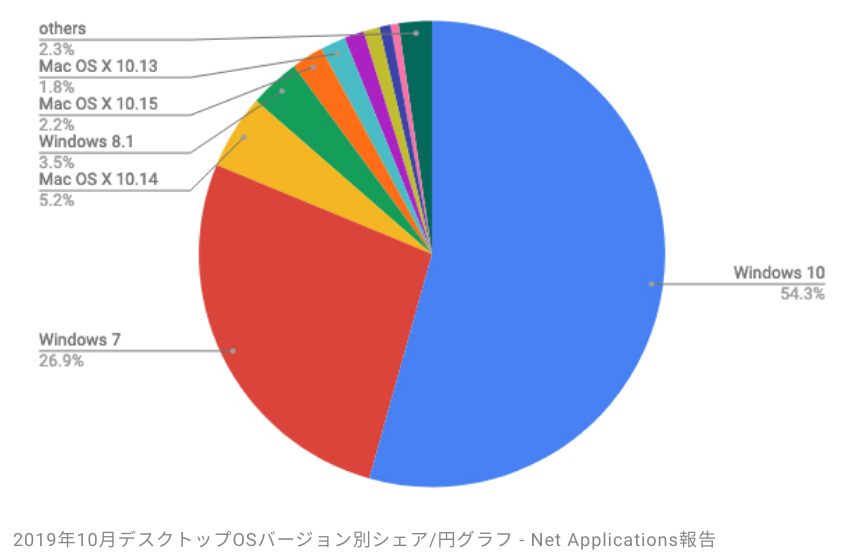
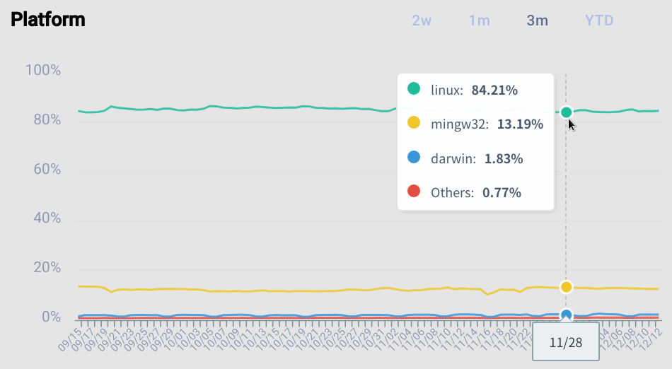
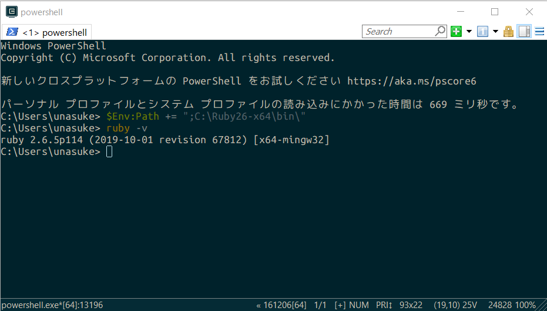

# あなたのそのgem、Windowsでも動きますか？
subtitle
: 2019-12-14

subtitle
: 平成Ruby会議01

author
: うなすけ

theme
: unasuke-white

# はじめに
ある日のことであった……


(私がこの発表をしようと思うようになったいきさつをお話しします。)

# Middleman
Ruby製の静的サイトジェネレーター
<https://middlemanapp.com/>

{:relative_width="40"}

# Middlemanの拡張gemを作ったのです
- Middlemanで生成したHTMLの\にloading="lazy"を付与するgemを作りました \| うなすけとあれこれ
  - <https://blog.unasuke.com/2019/middleman-lazy-img-loading/>
  - <https://github.com/unasuke/middleman-img_loading_attribute>

# 過程でMiddleman本体にPull Requestを出したのです
- <https://github.com/middleman/middleman/pull/2294>
  - "Conform generated gemspec to `bundle gem` style"
  - `middleman extension` コマンドによって生成される `gemspec` を `bundle gem` の形式に揃えるもの

# そしたらこんなコメントが……
> This is very nice. Is there a way to check if the shelling out to `git` is safe on Windows?

(意訳 「とてもいいね！ gitコマンドを呼び出してるけどWindowsでも大丈夫？」)

<https://github.com/middleman/middleman/pull/2294#issuecomment-540301124>


# MiddlemanはWindows対応を謳っている
> Windows users can install both using RubyInstaller. For windows RubyInstaller-Devkit is also required.

<https://github.com/middleman/middleman/blob/master/README.md>

でもCIはLinuxでしか動いていない！！！

<https://travis-ci.org/middleman/middleman>

そして私はMiddlemanにWindowsでのCIを追加しようと思ったのであった……

# いきさつのまとめ
- MiddlemanにPull Requestを出したらWindowsでの挙動を確認されたので、Windows環境でのCIを追加することにした
  - その過程で得られた知見をお話しします

{:relative_width="80"}

# 自己紹介
- 名前 : うなすけ
- 仕事 : フリーランスのプラグラマー
  - インフラ寄りサーバーサイドエンジニア
  - Ruby, Rails, Kubernetes...
- Itamae gem maintainer

- {::tag name="x-small"}GitHub [@unasuke](https://github.com/unasuke){:/tag}
- {::tag name="x-small"}Mastodon [@unasuke@mstdn.unasuke.com](https://mstdn.unasuke.com/@unasuke){:/tag}
- {::tag name="x-small"}Twitter [@yu\_suke1994](https://twitter.com/yu_suke1994){:/tag}

{:relative_width="24" align="right" relative_margin_right="-10" relative_margin_top="42"}

# アンケート、その前に
これから皆さんにアンケートを4つ出します。

絶対挙手してほしい！というわけではないですが、自分かどうだったかを思い出してみてください。

# アンケート
みなさん、どのOSを日常で使っていますか？

- macOS
  - Catalina
  - Mojave
- Linux
  - Ubuntu
  - Arch Linux (発表者のマシン)
- Windows

# アンケート2
みなさんは以下OSがインストールされているマシンを持っていますか？

- macOS
- Linux
- Windows

# アンケート3
みなさんが最初に触ったパソコンのOSは何でしたか？

- macOS
- Linux
- Windows
- その他

# アンケート4
みなさんはRubyGemを作成し、公開していますか？

- はい
- まだ

# OSのシェア (画像はマイナビより)
- <https://netmarketshare.com/operating-system-market-share.aspx>

{:relative_width="80"}

# Rubygems and Bundler metrics
{:relative_width="90"}

<https://ecosystem.rubytogether.org/>

# デスクトップOSのシェア
Windows `>>` macOS + others

⇒ Windowsで動けばユーザーが増える！！！

# WindowsでRubyを動かす方法
<https://rubyinstaller.org/> を使うとRubyをWindowsにインストールすることができます

- <https://railsgirls.jp/install#setup_for_windows_without_wsl>

# あなたのgem、Windowsで動きましたか？
{:relative_width="100"}

# gemがWindowsで動くようにしよう！
- MiddlemanのtestがWindowsでpassするようになるまでにやったことを紹介します

# shell commandを使わない
```ruby
def cleanup!
  Dir.chdir ROOT
  `rm -rf #{TMP}` if File.exist? TMP
end
```

<https://github.com/middleman/middleman/blob/ba2098ec/middleman-core/spec/support/given.rb>

Windowsには `rm` コマンドが存在しないので実行できない

# shell commandを使わない
```diff
 def cleanup!
   Dir.chdir ROOT
-  `rm -rf #{TMP}` if File.exist? TMP
+  FileUtils.remove_entry_secure(TMP) if File.exist? TMP
 end
```

`FileUtils` を使うなど、なるべく Pure Rubyで実装する

# なるべくPure Rubyで実装する

> 実のところWindows専用アプリでもないにも関わらずこれほど力を入れてWindows対応がなされているものって、なかなか見ないよ。本当に。頭が下がります。

<https://shyouhei.tumblr.com/post/64498820681/10年代のrubyコア用語集> より

# Gem.win_platform? で分岐する
Windowsとその他のOSで処理を分けたい場合、 `Gem.win_platform?` を使用する

```ruby
Cucumber::Rake::Task.new do |t|
  exempt_tags = ["--tags 'not @wip'"]
  exempt_tags = if Gem.win_platform?
                  ["--tags 'not(@wip or @skip-windows)'"]
                else
                  ["--tags 'not @wip'"]
                end
  #...
```

# あきらめる
「どうしてもWindowsでこの機能を動かすのはムリ〜〜」となったときは潔く諦める

(※ そのための `Gem.win_platform?` による分岐)

# ここまでのまとめ
- Pure Rubyで実装する
- `Gem.win_platform?` で処理を分岐する
- あきらめも時には大事

ローカルのWindowsでtestがpassするよう修正できましたか？
ではCIを有効にしていきます。

# CIを有効にする
Windowsが使用できるCI service

- GitHub Actions
- AppVeyor
- CircleCI

# CIを有効にする
Windowsが使用できるCI service

- GitHub Actions ← ☆
- AppVeyor
- CircleCI ← ☆

GitHub ActionsとCircleCIはcronによる定期実行をYAMLに書くことで設定できる

# CIに関して
GitHub Actionsではどんなに頑張っても落ちるtestがAppVeyorではすんなりpassしたりするので、
行き詰まったらCI serviceを変えてみるのも手です

(実体験 <https://github.com/middleman/middleman/pull/2297>)

#
> 実のところWindows専用アプリでもないにも関わらずこれほど力を入れてWindows対応がなされているものって、なかなか見ないよ。本当に。頭が下がります。ただ、ユーザー定義したライブラリとかで対応が残念な事があって、そのため結局総体としては残念なことになってしまうって場合はまま見受けられるので、その点残念。

<https://shyouhei.tumblr.com/post/64498820681/10年代のrubyコア用語集> より

# まとめ
- Pure Rubyで実装すればWindowsでも動く(可能性が高い)
- CIはcronで定期的に実行できると便利
- Windows対応やっていきましょう

# 時間があまったら宣伝
